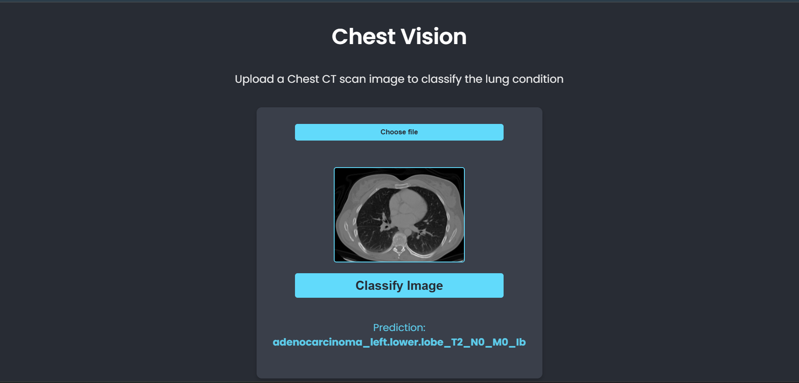

# ChestVision: AI-Powered Lung Condition Classifier

ChestVision is a full-stack web application that uses a deep learning model to classify lung conditions from uploaded chest CT scan images. A user can interact with a simple web interface to get a real-time prediction from a trained PyTorch model.

The project is built with a decoupled microservice architecture, separating the user interface, the backend logic, and the AI model into distinct, manageable services.



## Key Features

  - **Intuitive Interface**: A clean user interface for uploading CT scan images.
  - **Real-Time Classification**: Get immediate predictions from the AI model.
  - **Scalable Architecture**: The microservice design allows each part of the application (frontend, backend, AI) to be scaled and maintained independently.

## Tech Stack

  - **Frontend**: React, TypeScript, Axios
  - **Backend (API Gateway)**: Node.js, Express, TypeScript, Multer
  - **AI Service**: Python, Flask, PyTorch, Torchvision, Waitress
  - **Model**: ResNet-50 (pre-trained, with a custom final layer)
  - **Dataset**: `dorsar/lung-cancer` from Hugging Face Hub

## Architecture Overview

The application operates as three independent services that communicate via HTTP requests:

```
[ User Browser (React App @ Port 3000) ]
        |
        | (Image Upload)
        v
[ Node.js Backend (Express API @ Port 5000) ]
        |
        | (Forwards Image)
        v
[ Python AI Service (Flask/Waitress @ Port 8000) ]
```

1.  The **React Frontend** sends the user's uploaded image to the Node.js backend.
2.  The **Node.js Backend** acts as a middleman, forwarding the image to the Python AI service.
3.  The **Python AI Service** runs the image through the trained model, gets a prediction, and returns it.
4.  The result travels back through the backend to the frontend to be displayed to the user.

## Getting Started

Follow these instructions to get the project running on your local machine.

### Prerequisites

  - Node.js and npm
  - Python and pip

### Installation & Setup

1.  **Clone the repository:**

    ```bash
    git clone https://github.com/furyfist/ChestVision.git
    cd ChestVision
    ```

2.  **Set up the Python AI Service:**

    ```bash
    # Create and activate a virtual environment
    python -m venv venv
    .\venv\Scripts\activate  # On Windows

    # Install Python dependencies
    pip install -r ai-service/requirements.txt
    ```

3.  **Set up the Node.js Backend:**

    ```bash
    # Navigate to the backend directory
    cd backend

    # Install npm packages
    npm install
    ```

4.  **Set up the React Frontend:**

    ```bash
    # Navigate to the frontend directory (from the root)
    cd frontend

    # Install npm packages
    npm install
    ```

### Running the Application

You must have **three separate terminals** open to run all the services concurrently.

1.  **Terminal 1: Start the AI Service**

    ```bash
    # (In the root directory, with venv activated)
    cd ai-service
    waitress-serve --host=127.0.0.1 --port=8000 app:app
    ```

2.  **Terminal 2: Start the Backend**

    ```bash
    # (In a new terminal)
    cd backend
    npx ts-node-dev src/server.ts
    ```

3.  **Terminal 3: Start the Frontend**

    ```bash
    # (In a third terminal)
    cd frontend
    npm start
    ```

Once all servers are running, open your browser to `http://localhost:3000`.

## Future Improvements

  - **Deployment**: Deploy the services to a cloud platform (e.g., Vercel for frontend, Heroku/Render for backend, Google Cloud Run for AI).
  - **Model Enhancement**: Improve model accuracy through data augmentation, hyperparameter tuning, or experimenting with different architectures.
  - **Containerization**: Use Docker to containerize each service for more robust and portable deployment.