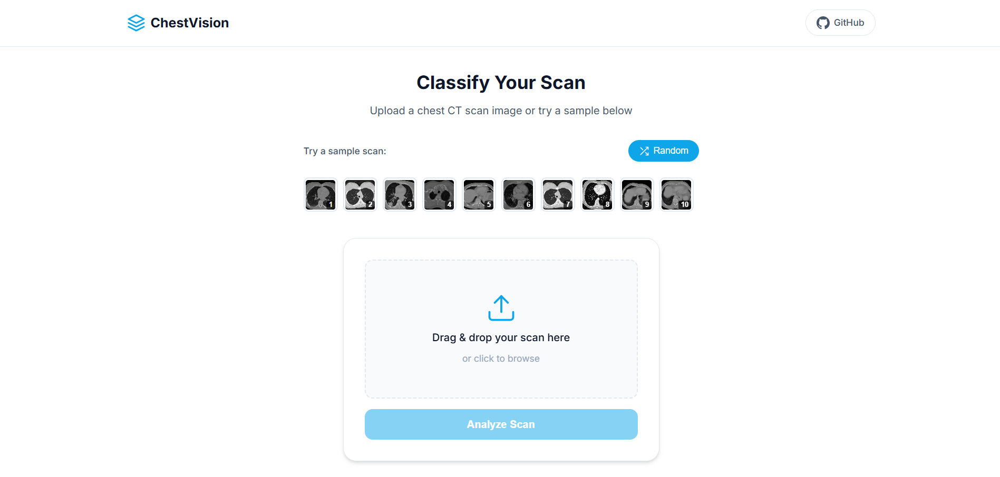

# ChestVision: AI-Powered Lung Condition Classifier

ChestVision is a full-stack web application that uses deep learning to classify lung conditions from chest CT scan images. Upload a scan through the clean web interface and get real-time predictions from a trained PyTorch model.

Built with a lean architecture, connecting the React frontend directly to the Flask AI service.



## ✨ Key Features

- **Real-Time Classification** - Get instant predictions within seconds of uploading
- **Sample Images Included** - 10 pre-loaded CT scans to test the model immediately
- **Deep Learning Powered** - ResNet-50 trained on the Hugging Face lung-cancer dataset
- **Modern UI** - Clean, professional light theme with smooth animations
- **Lean Architecture** - Streamlined design with frontend connecting directly to AI service

## 🛠️ Tech Stack

| Layer | Technologies |
|-------|-------------|
| **Frontend** | React, TypeScript, Axios |
| **AI Service** | Python, Flask, PyTorch, Torchvision |
| **Model** | ResNet-50 (transfer learning, 4-class output) |
| **Dataset** | [dorsar/lung-cancer](https://huggingface.co/datasets/dorsar/lung-cancer) from Hugging Face |

## 🏗️ Architecture

```
┌─────────────────────────────────────────────────────────┐
│                    User Browser                         │
│              (React App @ Port 3000)                    │
└─────────────────────┬───────────────────────────────────┘
                      │ Image Upload
                      ▼
┌─────────────────────────────────────────────────────────┐
│              Python AI Service                          │
│            (Flask @ Port 8000)                          │
└─────────────────────┬───────────────────────────────────┘
                      │
                      ▼
              🧠 Classification Result
```

## 🚀 Quick Start

### Prerequisites

- **Node.js** (v18+) and npm (for frontend)
- **Python** (3.10+) and pip

### 1. Clone the Repository

```bash
git clone https://github.com/furyfist/ChestVision.git
cd ChestVision
```

### 2. Set Up the AI Service (Python)

```bash
# Create and activate virtual environment
python -m venv venv

# Windows
.\venv\Scripts\activate

# macOS/Linux
source venv/bin/activate

# Install dependencies
pip install -r ai-service/requirements.txt
```

### 3. Set Up the Frontend (React)

```bash
cd frontend
npm install
cd ..

```

### 4. Run All Services

Open **2 separate terminals** and run:

**Terminal 1 - AI Service:**
```bash
cd ai-service
python app.py
```

**Terminal 2 - Frontend:**
```bash
cd frontend
npm start
```

### 5. Open the App

Visit **http://localhost:3000** in your browser.

Try the sample images or upload your own CT scan!

## 📁 Project Structure

```
ChestVision/
├── frontend/               # React TypeScript app
│   ├── src/
│   │   ├── components/     # Modular UI components
│   │   ├── App.tsx         # Main app component
│   │   └── App.css         # Styles
│   └── public/
│       └── samples/        # 10 sample CT images

├── ai-service/             # Flask + PyTorch
│   ├── app.py              # Flask API
│   ├── predict.py          # Model inference
│   ├── train.py            # Training script
│   ├── dataset.py          # Data loading
│   └── models/             # Saved model weights
└── README.md
```

## 🔮 Classification Categories

The model classifies scans into 4 categories:

| Category | Description |
|----------|-------------|
| **Normal** | Healthy lung tissue |
| **Adenocarcinoma** | Most common type, mucus-producing cells |
| **Squamous Cell Carcinoma** | Flat cells lining airways |
| **Large Cell Carcinoma** | Fast-growing, any lung area |

## ⚠️ Disclaimer

This tool is for **research and educational purposes only**. It is not intended for medical diagnosis. Always consult a healthcare professional for medical advice.

## 📄 License

MIT License - Feel free to use and modify for your projects.